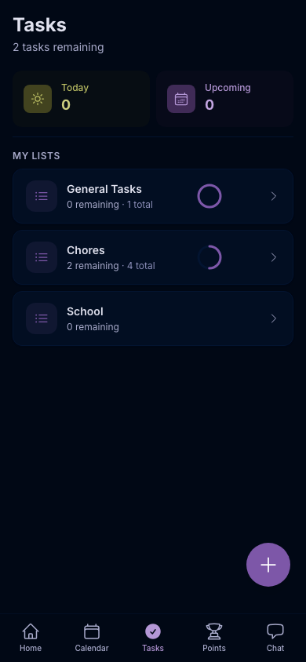

<p align="center">
  <h1 align="center">Q32 Hub</h1>
  <p align="center">
    <strong>A modern, open-source family hub for managing your household together.</strong>
  </p>
  <p align="center">
    Tasks &bull; Calendar &bull; Vault &bull; Points &bull; Badges &bull; Rewards &bull; AI Chat
  </p>
  <p align="center">
    <a href="#features">Features</a> &bull;
    <a href="#quick-start">Quick Start</a> &bull;
    <a href="#tech-stack">Tech Stack</a> &bull;
    <a href="#screenshots">Screenshots</a> &bull;
    <a href="#contributing">Contributing</a>
  </p>
</p>

---

Q32 Hub is a self-hosted family management app that brings your household's tasks, calendar, sensitive documents, and gamification into one beautiful interface. Built mobile-first with dark mode, it's designed for real families with kids who need a little motivation.

## Features

### Core Modules

- **Task Management** — Multiple task lists, priorities, due dates, assignees, family tasks anyone can claim, recurring tasks (daily/weekly/monthly via RRULE)
- **Family Calendar** — Aggregate Google Calendars from every family member, color-coded per person, month/week/day views
- **Secure Vault** — Encrypted storage for sensitive info (SSNs, medical records, financial data). Categories, role-based permissions, tap-to-reveal fields with auto-clear clipboard
- **AI Chat** — Ask Claude about your family data: "What tasks are due this week?", "What's my insurance policy number?"
- **MCP Server** — 26 tools for managing Q32 Hub through Claude Desktop or Claude Code

### Gamification System

Turn chores into a game your kids actually want to play.

- **Points** — Earn points by completing tasks. Parents can give kudos (+1 pt) or deduct points. Ledger-based architecture ensures every point is traceable.
- **Leaderboard** — Family rankings over configurable periods (daily/weekly/monthly). Resets each period without affecting point banks.
- **Rewards Store** — Parents create prizes (Sweets = 10 pts, Movie Pick = 40 pts, Stay Up Late = 75 pts). Kids purchase instantly — no approval flow.
- **Badges** — Steam-style achievements with hexagonal icons. Auto-triggered by milestones (50 tasks completed, 7-day streak, 1000 points earned) or manually awarded by parents. Hidden badges show as "???" until earned.
- **Activity Feed** — Real-time family feed showing task completions, kudos, purchases, and badge unlocks.

### Quality of Life

- **Dark Mode** — Full dark mode support across every view and component
- **Mobile-First** — Designed for phones first, scales beautifully to desktop
- **Feature Toggles** — Parents can enable/disable any module (calendar, tasks, vault, chat, points, badges)
- **Parent/Child Roles** — Parents get full control; children see only what's shared with them

## Screenshots

<p align="center">
  
  &nbsp;&nbsp;
  
  &nbsp;&nbsp;
  
</p>
<p align="center">
  
</p>

## Tech Stack

| Layer | Technology |
|-------|-----------|
| Backend | Laravel 11, PHP 8.2+ |
| Frontend | Vue 3 (Composition API, `<script setup>`) |
| State | Pinia |
| Styling | Tailwind CSS |
| Database | PostgreSQL 16, UUIDs |
| Cache/Queue | Redis 7 |
| Auth | Laravel Sanctum |
| MCP Server | TypeScript, Node.js |
| Build | Vite 5 |

## Quick Start

### Option 1: Native (macOS — Recommended for Development)

```bash
# Install dependencies
brew install php@8.3 composer postgresql@16 redis node
brew services start postgresql@16
brew services start redis

# Set up the project
git clone https://github.com/glqualls/q32hub.git
cd q32hub
cp .env.example .env
composer install
npm install
php artisan key:generate

# Create database and seed
createdb q32hub
php artisan migrate
php artisan db:seed

# Start dev servers (two terminals)
php artisan serve        # Terminal 1: API at localhost:8000
npm run dev              # Terminal 2: Vite at localhost:5173
```

### Option 2: Docker

```bash
git clone https://github.com/glqualls/q32hub.git
cd q32hub
cp .env.example .env
chmod +x setup.sh && ./setup.sh
```

### Demo Accounts

After seeding, log in with:

| Role | Email | Password |
|------|-------|----------|
| Parent | `parent@demo.local` | `password` |
| Child | `child@demo.local` | `password` |

## Configuration

### Environment Variables

Copy `.env.example` to `.env` and configure:

| Variable | Purpose |
|----------|---------|
| `DB_*` | PostgreSQL connection |
| `REDIS_*` | Redis connection |
| `GOOGLE_CLIENT_ID/SECRET` | Google Calendar integration |
| `ANTHROPIC_API_KEY` | AI chat features (optional) |

### Google Calendar

1. Create a project in [Google Cloud Console](https://console.cloud.google.com/)
2. Enable the Google Calendar API
3. Create OAuth 2.0 credentials
4. Add redirect URI: `http://localhost:8000/auth/google/callback`
5. Copy credentials to `.env`

## API

All routes are prefixed with `/api/v1/` and require Sanctum authentication.

```
Auth:     POST /register, /login, /logout, GET /user
Tasks:    CRUD /tasks, /task-lists, PATCH /tasks/{id}/toggle
Vault:    CRUD /vault/entries, /vault/categories, permissions, documents
Calendar: GET /calendar/events, /calendar/connections, POST /calendar/connect
Points:   GET /points/bank, /leaderboard, /feed, POST /kudos, /deduct
Rewards:  CRUD /rewards, POST /rewards/{id}/purchase
Badges:   CRUD /badges, POST /badges/{id}/award, DELETE /badges/{id}/revoke/{user}
Family:   GET /family, /members, POST /invite, PUT /settings
Chat:     POST /chat, GET /chat/history
```

## MCP Server

Manage Q32 Hub through Claude Desktop or Claude Code with 26 tools.

```bash
cd mcp-server && npm install && npm run build
```

Add to your Claude config:

```json
{
  "mcpServers": {
    "q32hub": {
      "command": "node",
      "args": ["/path/to/q32hub/mcp-server/dist/index.js"],
      "env": {
        "Q32HUB_API_URL": "http://localhost:8000/api/v1",
        "Q32HUB_API_TOKEN": "your-sanctum-token"
      }
    }
  }
}
```

## Project Structure

```
q32hub/
├── app/
│   ├── Console/Commands/       # Artisan commands (recurring tasks)
│   ├── Enums/                  # FamilyRole, TaskPriority, PointTransactionType, BadgeTriggerType
│   ├── Http/Controllers/Api/   # 12 REST controllers
│   ├── Models/                 # 14 Eloquent models
│   ├── Policies/               # Authorization policies
│   └── Services/               # Business logic (Points, Badges, Calendar, Vault, Chat)
├── database/migrations/        # 17 migrations
├── resources/js/
│   ├── components/             # Vue components (layout, common, tasks, vault, points, badges, etc.)
│   ├── views/                  # Page views (dashboard, tasks, vault, calendar, points, badges, etc.)
│   ├── stores/                 # 7 Pinia stores
│   ├── composables/            # Vue composables
│   └── router/                 # Vue Router with module guards
├── mcp-server/                 # TypeScript MCP server (26 tools)
└── docs/                       # Architecture, roadmap, conventions
```

## Contributing

Contributions are welcome! This is a real app used by a real family, so quality matters.

1. Fork the repository
2. Create a feature branch: `git checkout -b feature/your-feature`
3. Make your changes
4. Ensure the build passes: `npx vite build`
5. Commit with clear messages
6. Open a Pull Request

### Code Style

- **PHP**: PSR-12 (Pint)
- **Vue**: Single File Components with `<script setup>`, Composition API
- **CSS**: Tailwind utilities, mobile-first, dark mode via `dark:` variants in `@layer components`

## Documentation

| Document | Purpose |
|----------|---------|
| [CLAUDE.md](CLAUDE.md) | Project context for AI assistants — the single source of truth |
| [docs/ARCHITECTURE.md](docs/ARCHITECTURE.md) | Technical decisions with reasoning |
| [docs/ROADMAP.md](docs/ROADMAP.md) | Feature roadmap with status tracking |
| [docs/CONVENTIONS.md](docs/CONVENTIONS.md) | Coding standards and patterns |
| [CHANGELOG.md](CHANGELOG.md) | Session-by-session development log |

## Roadmap

See [docs/ROADMAP.md](docs/ROADMAP.md) for the full plan. Coming up:

- Two-way calendar sync (create events from hub)
- Push notifications / PWA
- Meal planning and grocery lists
- Family chat and messaging
- Budget tracking and allowances
- Mobile app (React Native)

## License

[MIT License](LICENSE) — use it, fork it, make it yours.

---

<p align="center">
  Built with care by <a href="https://github.com/glqualls">Greg Qualls</a> and <a href="https://claude.ai">Claude</a>.
</p>
