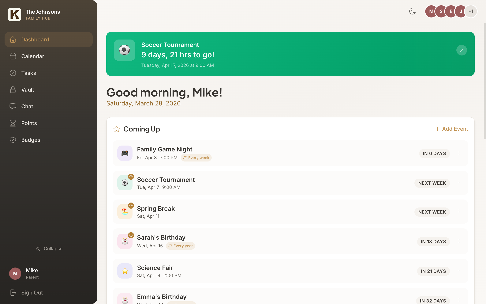
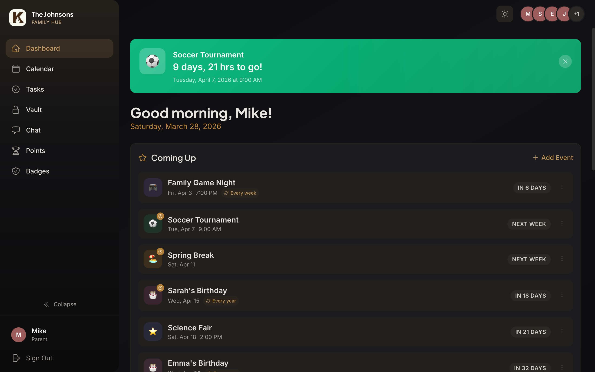
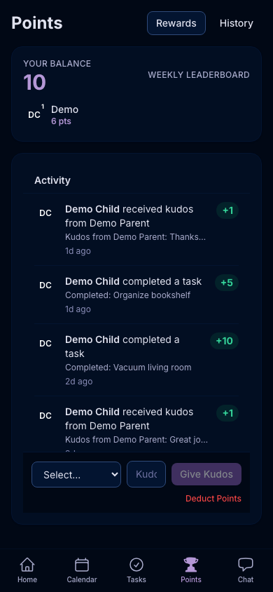
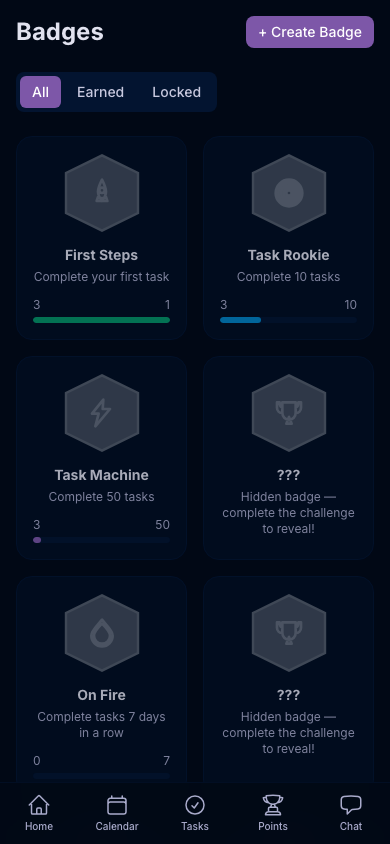
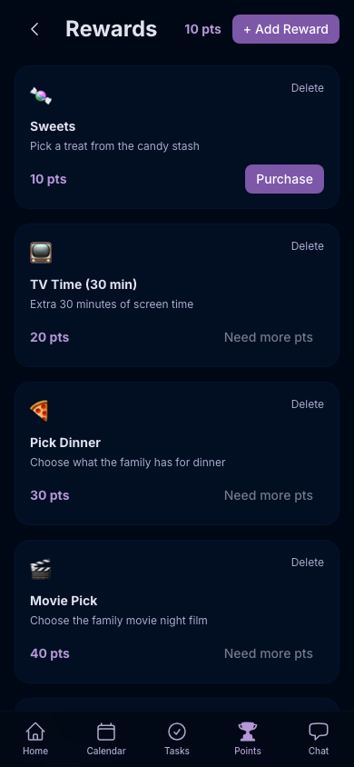
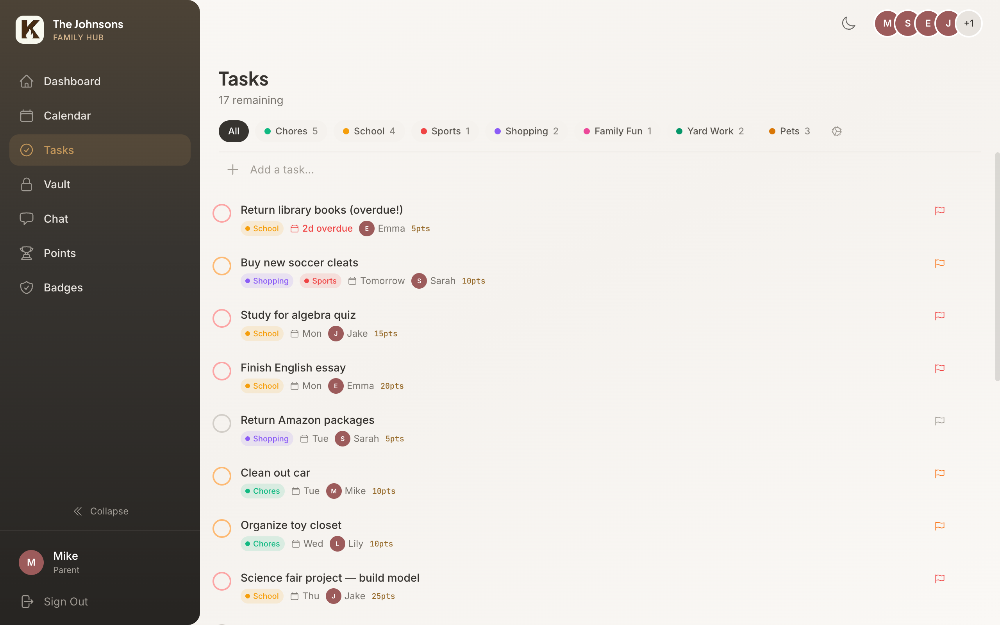
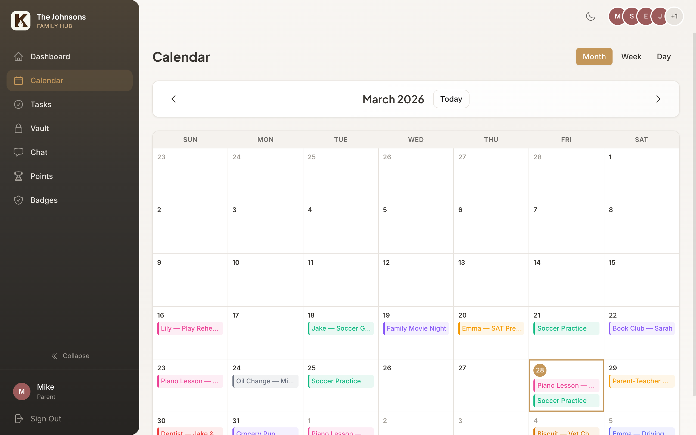
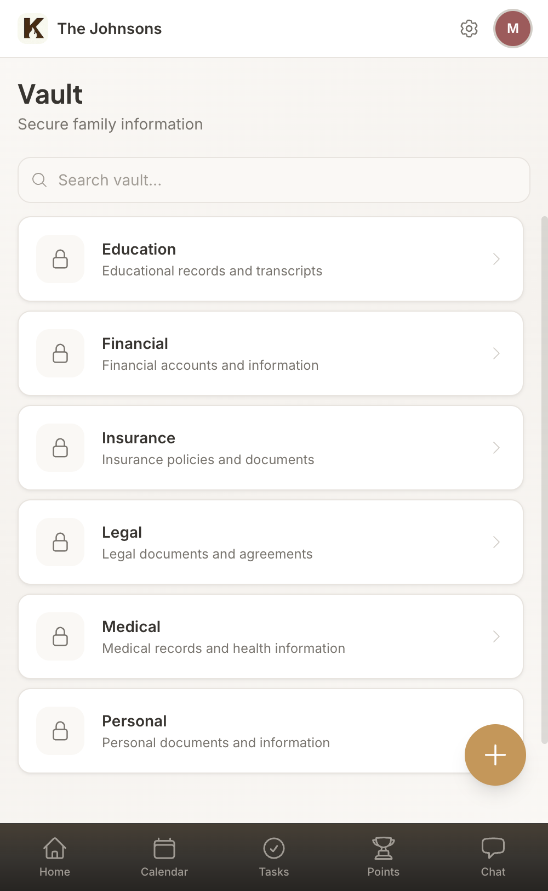
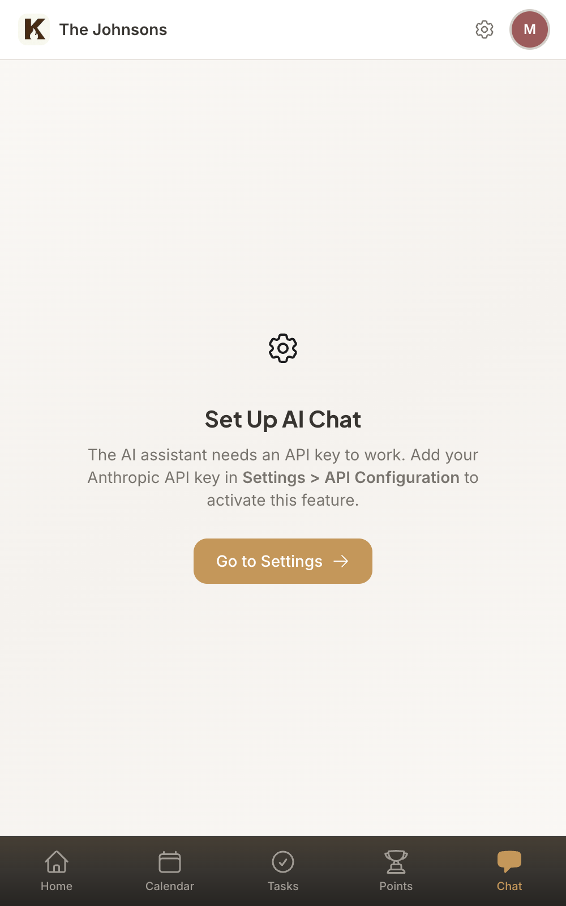

<p align="center">
  
</p>

<h1 align="center">Kinhold</h1>

<p align="center">
  <strong>The open-source family hub. Tasks, calendar, vault, gamification, and AI — self-hosted, private, yours.</strong>
</p>

<p align="center">
  <a href="#features">Features</a> &bull;
  <a href="#screenshots">Screenshots</a> &bull;
  <a href="#quick-start">Quick Start</a> &bull;
  <a href="#tech-stack">Tech Stack</a> &bull;
  <a href="#mcp-server">MCP Server</a> &bull;
  <a href="#contributing">Contributing</a>
</p>

<p align="center">
  <a href="LICENSE"></a>
  <a href="https://github.com/gregqualls/kinhold/stargazers"></a>
</p>

<p align="center">
  
</p>

---

Kinhold is a self-hosted family management app that brings tasks, calendar, sensitive documents, and gamification into one interface. Built mobile-first with dark mode and multiple color themes, it's designed for real families with kids who need a little motivation to get things done.

Live at [kinhold.app](https://kinhold.app)

## Features

### Core Modules

- **Task Management** — Multiple task lists, priorities, due dates, assignees. Family tasks anyone can claim. Recurring tasks via RRULE (daily, weekly, monthly). Points awarded on completion.
- **Family Calendar** — Aggregate Google Calendars from every family member, color-coded per person, with month/week/day views. Manual calendar events let families add events without needing a Google Calendar connection.
- **Secure Vault** — Encrypted storage for sensitive family info (SSNs, medical records, insurance, financial data). Role-based permissions, tap-to-reveal fields, auto-clear clipboard.
- **AI Chat** — Ask questions about your family data: "What tasks are due this week?", "What's the wifi password?", "When is the next dentist appointment?" Powered by Claude.
- **MCP Server** — 18 tools for managing Kinhold through Claude Desktop or Claude Code. Full CRUD on tasks, vault, calendar, and family data. Laravel-native, no separate process.

### Gamification

Turn chores into a game your kids actually want to play.

- **Points** — Earn points by completing tasks. Parents can give kudos (+1 pt) or deduct points. Ledger-based architecture — every point is traceable, no balance mutations.
- **Leaderboard** — Family rankings over configurable periods (daily/weekly/monthly). Resets each period without touching point banks.
- **Rewards Store** — Parents create prizes with point costs (Sweets = 10 pts, Movie Pick = 40 pts). Kids purchase instantly.
- **Badges** — Steam-style achievements with hexagonal icons. 27 default badges auto-created for every family. Auto-triggered by milestones (first task completed, 7-day streak, 1000 points earned) or manually awarded by parents. Hidden badges show as "???" until earned.
- **Activity Feed** — Family-wide feed showing task completions, kudos, purchases, and badge unlocks.

### Quality of Life

- **Dark Mode** — Full dark mode across every view and component, with subtle gradient depth effects
- **Color Themes** — 5 built-in themes (Prussian, Wisteria, Lavender, Sand, Ink) applied via CSS custom properties
- **Mobile-First** — Designed for phones first, scales to desktop with a sidebar layout
- **Feature Toggles** — Parents can enable/disable any module (calendar, tasks, vault, chat, points, badges)
- **Parent/Child Roles** — Parents get full control; children see only what's shared with them
- **Managed Accounts** — Parents can create child accounts without email and switch into them
- **Google OAuth** — Sign in with Google, or use email/password
- **Landing Page** — Public homepage at `/` for unauthenticated visitors
- **Easter Eggs** — Hidden surprises scattered throughout the app. Find them all to unlock secret badges.

## Screenshots

<p align="center">
  
  &nbsp;&nbsp;
  
</p>

<p align="center">
  
  &nbsp;&nbsp;
  
  &nbsp;&nbsp;
  
</p>

<details>
<summary><strong>More screenshots</strong></summary>
<br />
<p align="center">
  
  &nbsp;&nbsp;
  
</p>
<p align="center">
  
  &nbsp;&nbsp;
  
</p>
</details>

## Tech Stack

| Layer | Technology |
|-------|-----------|
| Backend | Laravel 11, PHP 8.2+ |
| Frontend | Vue 3 (Composition API, `<script setup>`) |
| State | Pinia (8 stores) |
| Styling | Tailwind CSS |
| Database | PostgreSQL 16, UUIDs |
| Cache/Queue | Redis 7 |
| Auth | Laravel Sanctum + Google OAuth via Socialite |
| AI | Anthropic Claude API (multi-provider ready) |
| MCP Server | Laravel-native (PHP, 18 tools) |
| Build | Vite 5 |
| Hosting | [Upsun](https://upsun.com) |

## Quick Start

### Option 1: Native (macOS — Recommended)

```bash
# Install dependencies
brew install php@8.3 composer postgresql@16 redis node
brew services start postgresql@16
brew services start redis

# Clone and set up
git clone https://github.com/gregqualls/kinhold.git
cd kinhold
cp .env.example .env
composer install
npm install
php artisan key:generate

# Create database and seed demo data
createdb kinhold
php artisan migrate
php artisan db:seed

# Start dev servers (two terminals)
php artisan serve        # Terminal 1: API at localhost:8000
npm run dev              # Terminal 2: Vite at localhost:5173
```

### Option 2: Docker

```bash
git clone https://github.com/gregqualls/kinhold.git
cd kinhold
cp .env.example .env
chmod +x setup.sh && ./setup.sh
```

### Demo Accounts

After seeding, log in with any of these:

| Role | Email | Password |
|------|-------|----------|
| Parent | `parent@demo.local` | `password` |
| Parent | `sarah@demo.local` | `password` |
| Child (16) | `emma@demo.local` | `password` |

Two additional children (Jake, 14 and Lily, 12) are managed accounts — switch to them from Settings.

## Configuration

### Environment Variables

Copy `.env.example` to `.env` and configure:

| Variable | Purpose |
|----------|---------|
| `DB_*` | PostgreSQL connection |
| `REDIS_*` | Redis connection |
| `GOOGLE_CLIENT_ID` / `GOOGLE_CLIENT_SECRET` | Google OAuth + Calendar |
| `ANTHROPIC_API_KEY` | AI chat (optional) |

### Google Calendar + OAuth

1. Create a project in [Google Cloud Console](https://console.cloud.google.com/)
2. Enable the Google Calendar API
3. Create OAuth 2.0 credentials
4. Add redirect URIs: `http://localhost:8000/auth/google/callback` (dev) and your production URL
5. Copy client ID and secret to `.env`

## API

All routes prefixed with `/api/v1/`. Auth routes are public, everything else requires Sanctum authentication.

```
Auth:      POST /register, /login, /logout, GET /user
Tasks:     CRUD /tasks, /task-lists, POST /tasks/{id}/complete, /uncomplete
Vault:     CRUD /vault/entries, /vault/categories, permissions, documents
Calendar:  GET /calendar/events, /connections, POST /connect, /sync
Points:    GET /points/bank, /leaderboard, /feed, POST /kudos, /deduct
Rewards:   CRUD /rewards, POST /rewards/{id}/purchase
Badges:    CRUD /badges, POST /badges/{id}/award, DELETE /badges/{id}/revoke/{user}
Family:    GET /family, /members, POST /invite, PUT /settings
Chat:      POST /chat, GET /chat/history
Settings:  GET /settings, PUT /settings
```

## MCP Server

Kinhold includes a Laravel-native MCP server that lets you manage your family hub entirely through AI clients like Claude Desktop, Claude Code, Cursor, or Windsurf. The server runs at the `/mcp` endpoint using Laravel's built-in MCP support — no separate process, no TypeScript, no Node.js.

Authentication uses Sanctum bearer tokens. Generate a token in **Settings > MCP Token** within the app, then add it to your AI client config.

### Claude Desktop Configuration

```json
{
  "mcpServers": {
    "kinhold": {
      "type": "streamableHttp",
      "url": "https://kinhold.app/mcp",
      "headers": {
        "Authorization": "Bearer YOUR_SANCTUM_TOKEN"
      }
    }
  }
}
```

For local development, use `http://localhost:8000/mcp` as the URL.

### Available Tools (18)

| Tool | Description |
|------|-------------|
| ManageTaskLists | Create, update, delete, and list task lists |
| ManageTasks | Create, update, delete, and list tasks |
| CompleteTask | Mark tasks complete or incomplete |
| ManageTags | Create, update, delete, and list tags |
| ViewPoints | View point balances, leaderboard, and activity feed |
| ManagePoints | Give kudos and deduct points |
| ManagePointRequests | Handle point requests from family members |
| ManageRewards | Create, update, delete, and list rewards |
| PurchaseReward | Purchase a reward with points |
| ManageBadges | Create, update, delete, and list badges |
| ViewEarnedBadges | View earned badges for family members |
| ManageFeaturedEvents | Set and manage featured events on the dashboard |
| ViewCalendar | View aggregated family calendar events |
| ManageVault | Create, update, delete, and list vault entries |
| ManageVaultAccess | Set per-user permissions on vault entries |
| ViewFamily | View family members and family info |
| GetSettings | Retrieve app and family settings |
| SearchFamily | Search across tasks, vault, and calendar |

All tools are scoped to the authenticated user's family. Write operations require the `parent` role.

## Project Structure

```
kinhold/
├── app/
│   ├── Console/Commands/       # Artisan commands (recurring tasks, badge seeding)
│   ├── Enums/                  # FamilyRole, TaskPriority, PointTransactionType, BadgeTriggerType
│   ├── Http/Controllers/Api/   # 16 REST controllers
│   ├── Mcp/                    # Laravel-native MCP server
│   │   ├── Servers/            # MCP server registration
│   │   └── Tools/              # 18 MCP tool classes
│   ├── Models/                 # 17 Eloquent models
│   ├── Policies/               # Authorization policies
│   └── Services/               # Business logic (Points, Badges, Calendar, Vault, Chat)
├── database/migrations/        # 30 migrations
├── resources/js/
│   ├── components/             # Vue components (layout, common, tasks, vault, points, badges, etc.)
│   ├── views/                  # 19 page views across 10 modules
│   ├── stores/                 # 8 Pinia stores
│   ├── composables/            # Vue composables (notifications, dark mode, themes, colors)
│   └── router/                 # Vue Router with auth guards
├── .upsun/                     # Production deployment config
└── docs/                       # Architecture, roadmap, conventions
```

## Deploying Your Own Instance

Kinhold is designed to be forked and self-hosted. Every family gets their own instance with their own data.

1. Fork this repo on GitHub
2. Connect your fork to [Upsun](https://upsun.com) (or any host that supports PHP + PostgreSQL + Redis)
3. Set your environment variables (APP_KEY, DB creds, Google OAuth, Anthropic key)
4. Deploy — the `.upsun/config.yaml` handles build and deploy hooks automatically
5. To pull upstream updates: `git remote add upstream https://github.com/gregqualls/kinhold.git && git pull upstream main`

## Contributing

Contributions are welcome! See [CONTRIBUTING.md](CONTRIBUTING.md) for setup instructions, code conventions, and our principles checklist. Every PR is evaluated against our [core product principles](PRINCIPLES.md).

Found a bug or have an idea? Open an issue on [GitHub Issues](https://github.com/gregqualls/kinhold/issues). Want to discuss the project? Start a thread in [GitHub Discussions](https://github.com/gregqualls/kinhold/discussions).

## Documentation

| Document | Purpose |
|----------|---------|
| [PRINCIPLES.md](PRINCIPLES.md) | Core product principles that guide every decision |
| [CONTRIBUTING.md](CONTRIBUTING.md) | How to contribute |
| [CLAUDE.md](CLAUDE.md) | Project context for AI assistants |
| [docs/ARCHITECTURE.md](docs/ARCHITECTURE.md) | Technical decisions and reasoning |
| [docs/ROADMAP.md](docs/ROADMAP.md) | Feature roadmap with status |
| [docs/CONVENTIONS.md](docs/CONVENTIONS.md) | Coding standards and patterns |
| [CHANGELOG.md](CHANGELOG.md) | Development log |

## Roadmap

See [docs/ROADMAP.md](docs/ROADMAP.md) for the full plan. Coming up:

- ~~Manual calendar mode (create events without Google)~~ Done
- Profile pictures and avatars
- Granular access control per module
- Meal planning and grocery lists
- Mobile app (PWA)

## License

[MIT License](LICENSE) — use it, fork it, make it yours.

---

<p align="center">
  Built with care by <a href="https://github.com/gregqualls">Greg Qualls</a> and <a href="https://claude.ai">Claude</a>.
</p>
